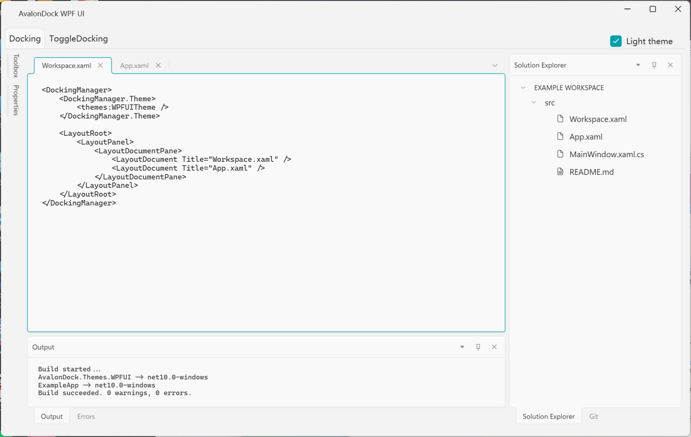
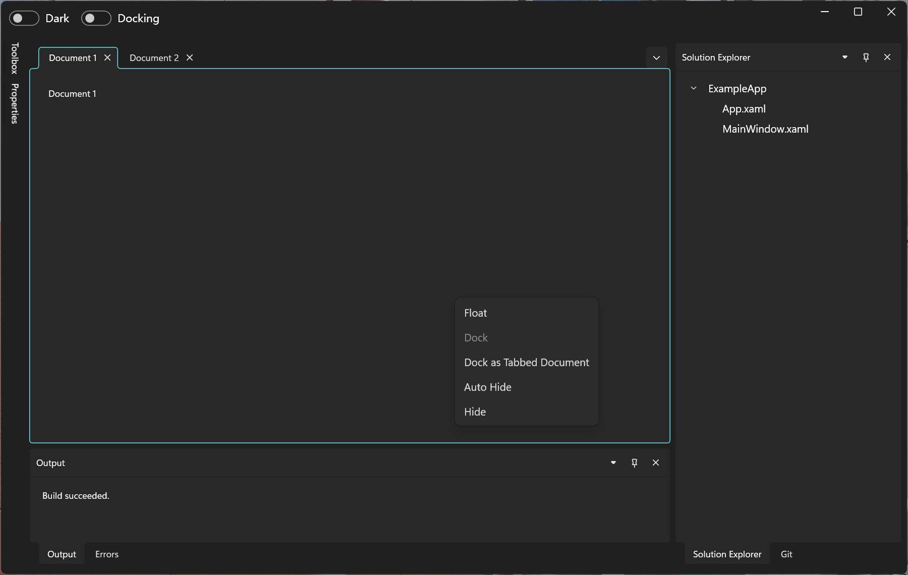
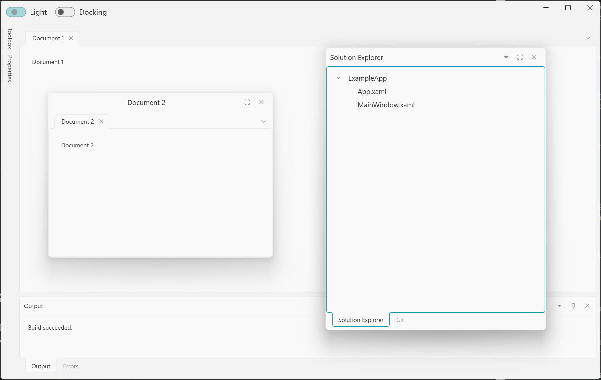
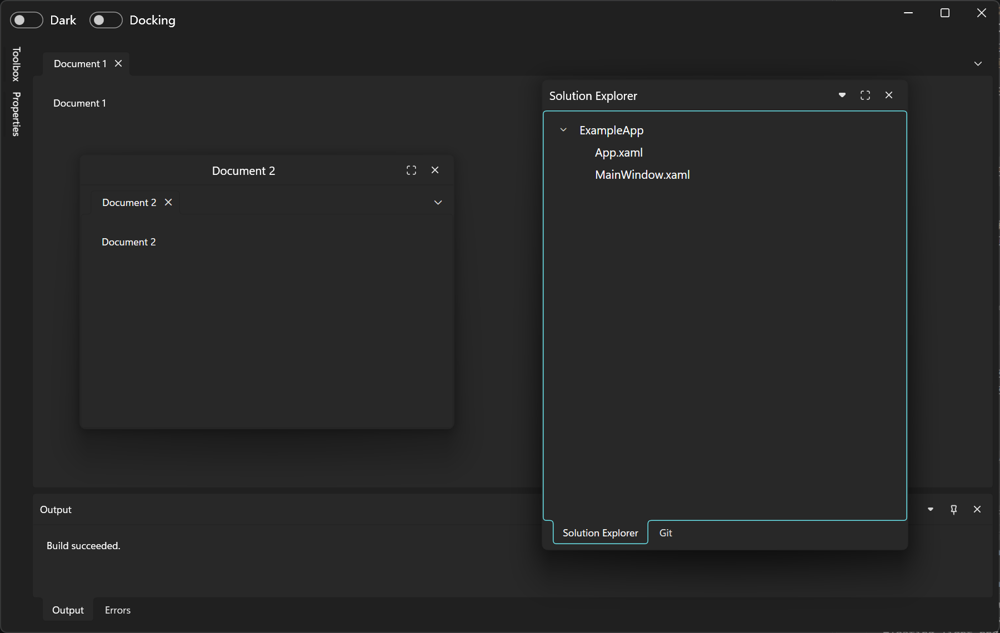
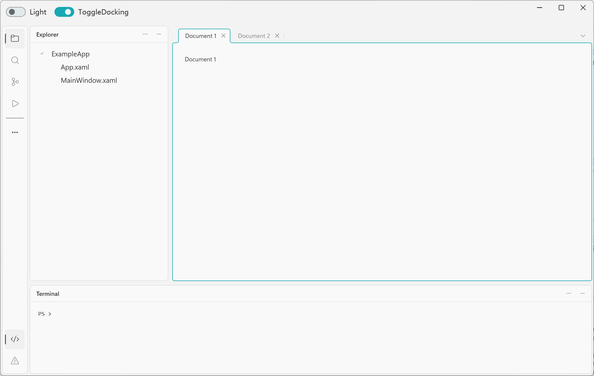
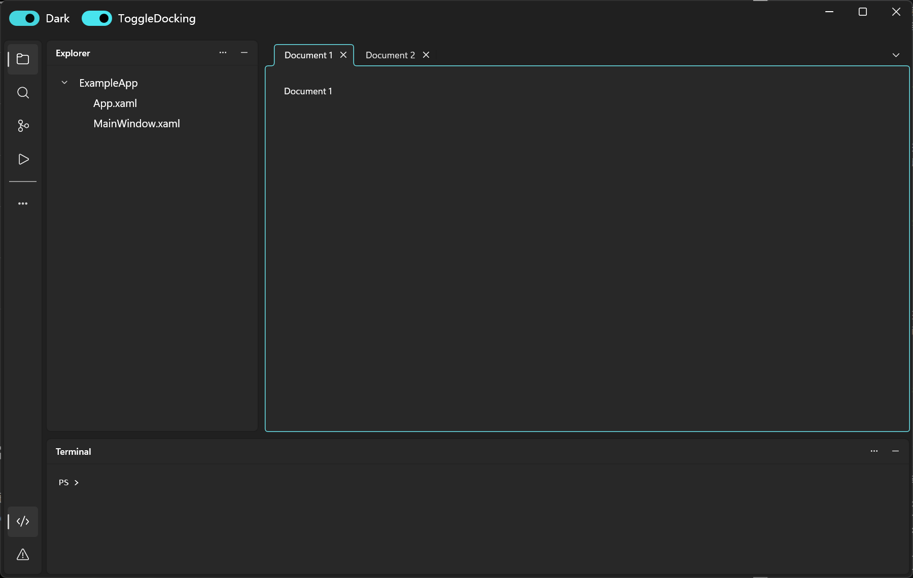
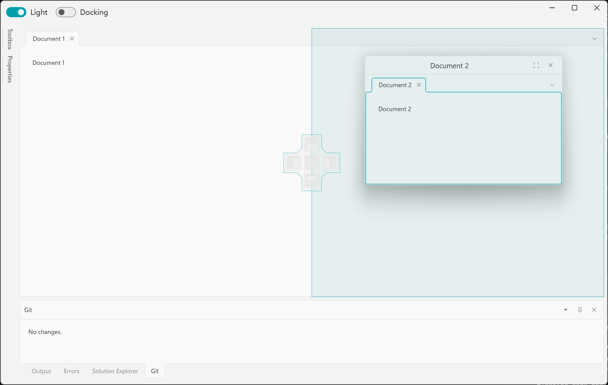
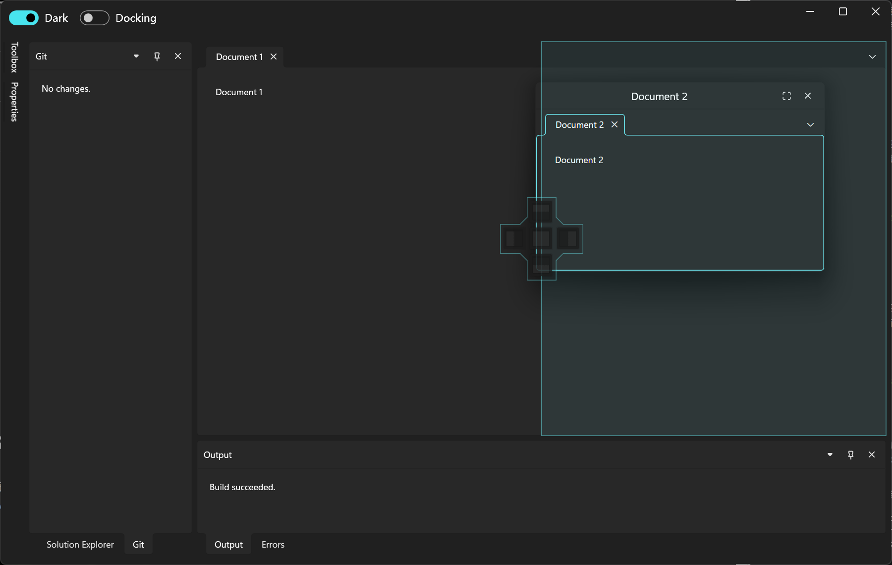

# AvalonDock.Themes.WPFUI

[](https://nuget.org/packages/AvalonDock.Themes.WPFUI)

Fluent-style themes for [AvalonDock](https://github.com/Dirkster99/AvalonDock), built with [WPF UI](https://github.com/lepoco/wpfui).

The theme supports both `DockingManager` and `ToggleDockingManager`, styling document tabs, tool panes, auto-hide tabs, toggle sidebars, floating windows, and docking guides using WPF UI's light and dark palettes. Docking and layout management remain provided by AvalonDock.

## Screenshots

Theme previews with illustrative content that may differ from the minimal example application. The code, file-tree, and Git views are demonstration content, not controls included with the theme. Select an image to view it at full size.

### Docked Layout

| Light | Dark |
| :---: | :---: |
| [](Screenshots/docked-light.png) | [](Screenshots/docked-dark.png) |

### Floating Windows

| Light | Dark |
| :---: | :---: |
| [](Screenshots/floating-light.png) | [](Screenshots/floating-dark.png) |

### ToggleDocking Layout

| Light | Dark |
| :---: | :---: |
| [](Screenshots/toggle-docking-light.png) | [](Screenshots/toggle-docking-dark.png) |

### Docking Preview

| Light | Dark |
| :---: | :---: |
| [](Screenshots/docking-preview-light.png) | [](Screenshots/docking-preview-dark.png) |

## Requirements

The current source targets Windows WPF applications using:

- .NET Framework 4.8 or .NET 10 (`net10.0-windows`).
- Dirkster.AvalonDock 5.0.0 and WPF-UI 4.3.0, referenced by the theme package.

## Getting Started

### 1. Install the Package

Run in your WPF application project directory:

```powershell
dotnet add package AvalonDock.Themes.WPFUI
```

### 2. Register Theme Resources

Merge the WPF UI theme and control dictionaries and the AvalonDock theme dictionary into [App.xaml](src/ExampleApp/App.xaml). In the example below, replace `YourApp` with your application's namespace and keep your existing startup settings and other resources.

```xaml
<Application x:Class="YourApp.App"
             xmlns="http://schemas.microsoft.com/winfx/2006/xaml/presentation"
             xmlns:x="http://schemas.microsoft.com/winfx/2006/xaml"
             xmlns:ui="http://schemas.lepo.co/wpfui/2022/xaml"
             StartupUri="MainWindow.xaml">
    <Application.Resources>
        <ResourceDictionary>
            <ResourceDictionary.MergedDictionaries>
                <ui:ThemesDictionary Theme="Light" />
                <ui:ControlsDictionary />
                <ResourceDictionary Source="pack://application:,,,/AvalonDock.Themes.WPFUI;component/Theme.xaml" />
            </ResourceDictionary.MergedDictionaries>
        </ResourceDictionary>
    </Application.Resources>
</Application>
```

Use `Theme="Dark"` for a dark palette. Keeping the AvalonDock dictionary at application scope also makes the theme available to dynamically created Toggle sidebar buttons while they are detached from the manager.

### 3. Apply the AvalonDock Theme

Set `DockingManager.Theme` to `WPFUITheme`. This minimal example creates a single document; you can keep your existing AvalonDock layout instead.

```xaml
<dock:DockingManager
    xmlns="http://schemas.microsoft.com/winfx/2006/xaml/presentation"
    xmlns:dock="clr-namespace:AvalonDock;assembly=AvalonDock"
    xmlns:layout="clr-namespace:AvalonDock.Layout;assembly=AvalonDock"
    xmlns:wpfui="clr-namespace:AvalonDock.Themes.WPFUI;assembly=AvalonDock.Themes.WPFUI">
    <dock:DockingManager.Theme>
        <wpfui:WPFUITheme />
    </dock:DockingManager.Theme>
    <layout:LayoutRoot>
        <layout:LayoutPanel>
            <layout:LayoutDocumentPane>
                <layout:LayoutDocument Title="Document 1">
                    <TextBlock Margin="16" Text="Document content" />
                </layout:LayoutDocument>
            </layout:LayoutDocumentPane>
        </layout:LayoutPanel>
    </layout:LayoutRoot>
</dock:DockingManager>
```

### ToggleDockingManager

With the application resources above, apply the same `WPFUITheme` to `ToggleDockingManager`:

```xaml
<dock:ToggleDockingManager
    xmlns="http://schemas.microsoft.com/winfx/2006/xaml/presentation"
    xmlns:dock="clr-namespace:AvalonDock;assembly=AvalonDock"
    xmlns:wpfui="clr-namespace:AvalonDock.Themes.WPFUI;assembly=AvalonDock.Themes.WPFUI"
    ButtonSize="40">
    <dock:ToggleDockingManager.Theme>
        <wpfui:WPFUITheme />
    </dock:ToggleDockingManager.Theme>
</dock:ToggleDockingManager>
```

Define panels with AvalonDock's layout models and use `ToggleDock.Icon` / `ToggleDock.IconTemplate` to configure sidebar icons. The theme supports image icons, custom icon content, text-only buttons, and the manager's header button visibility settings. See [ToggleDockingPage.xaml](src/ExampleApp/Views/ToggleDockingPage.xaml) for a XAML-only layout.

### Tabbed Hosts

With AvalonDock 5.0.0, keep docking managers outside an enclosing `TabItem` or other `Selector`. For tabbed navigation, place the tab headers and page host in separate sibling containers, as in [MainWindow.xaml](src/ExampleApp/MainWindow.xaml). This avoids a read-only `IsSelectionActive` property conflict when focus moves to a floating window.

## Floating Window Minimum Size

Floating windows have a minimum outer size of 280 x 180 DIPs for documents and 200 x 140 DIPs for tools. This keeps the title bar and window controls usable when no floating size has been configured or a saved size is too small. Larger window and layout-model minimums are preserved; docked pane constraints and larger floating sizes are unchanged.

## Example Application

[ExampleApp](src/ExampleApp/ExampleApp.csproj) is a minimal UI showcase with two tabs:

- **Docking:** document tabs, docked tool panes, and auto-hide tabs.
- **ToggleDocking:** document tabs, icon sidebars, and toggleable tool panes.

All document and tool content is declared directly in XAML using static text, lists, and trees. The example demonstrates light/dark themes and AvalonDock's built-in docking, floating, and auto-hide interactions; it does not implement file editing, search, Git, or terminal functionality. Floating-window visibility during page changes is handled by AvalonDock's page loading and unloading lifecycle.

To build the solution, use Windows with the .NET 10 SDK and .NET Framework 4.8 targeting pack. Run the following commands from the repository root:

```powershell
dotnet build AvalonDock.Themes.WPFUI.slnx
dotnet run --project src/ExampleApp/ExampleApp.csproj --framework net10.0-windows
```

## References

- [AvalonDock](https://github.com/Dirkster99/AvalonDock)
- [WPF-UI](https://github.com/lepoco/wpfui)
- [AakStudio.Shell.UI.Themes.AvalonDock](https://github.com/Wenveo/AakStudio.Shell.UI.Themes.AvalonDock)

## License

Licensed under the [MIT License](LICENSE).